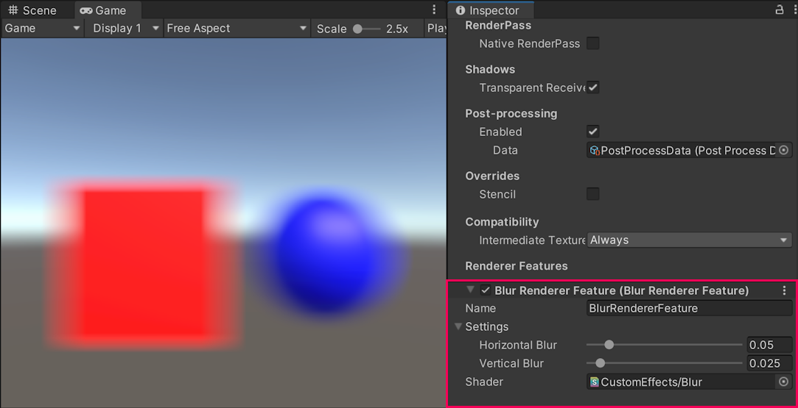
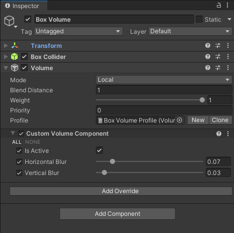

# How to create a custom Renderer Feature

This section describes how to create a [custom Renderer Feature](./scriptable-renderer-features/intro-to-scriptable-renderer-features.md) for a URP Renderer.

This walkthrough contains the following sections:

* [Overview of this example implementation](#example-implementation-overview)
* [Create example Scene and GameObjects](#example-scene)
* [Create a scriptable Renderer Feature and add it to the Universal Renderer](#scriptable-renderer-feature)
    * [Add the Renderer Feature to the the Universal Renderer asset](#add-renderer-feature-to-asset)
* [Create the scriptable Render Pass](#scriptable-render-pass)
* [Implement the settings for the custom render pass](#implement-the-settings-for-the-custom-render-pass)
* [Enqueue the render pass in the custom renderer feature](#enqueue-the-render-pass-in-the-custom-renderer-feature)
* [Implement the volume component](#volume-component)
* [Complete code for the scripts in this example](#complete-code-for-the-scripts-in-this-example)
    * [Custom Renderer Feature code](#code-renderer-feature)
    * [Custom render pass code](#code-render-pass)
    * [Volume Component code](#code-volume-component)
* [The custom shader for the blur effect](#example-shader)

## <a name="example-implementation-overview"></a>Overview of this example implementation

The example workflow on this page implements a custom Renderer Feature that uses [custom Render Passes](./scriptable-renderer-features/intro-to-scriptable-render-passes.md) to add a blur effect to the camera output.

The implementation consists of the following parts:

* A `ScriptableRendererFeature` instance that enqueues a `ScriptableRenderPass` instance every frame.

* A `ScriptableRenderPass` instance that performs the following steps:

    * Creates a temporary render texture using the `RenderTextureDescriptor` API.

    * Applies two passes of the [custom shader](#example-shader) to the camera output using the `RTHandle` and the `Blit` API.

## <a name="example-scene"></a>Create example Scene and GameObjects

To set your project up for this example workflow:

1. Create a new Scene.

1. Create two GameObjects: a Cube GameObject called `Cube`, and a Sphere GameObject called `Sphere`.

2. Create two Materials with a shader that lets you specify the base color (for example, the `Universal Render Pipeline/Lit` shader). Call the Materials `Blue` and `Red`, and set the base colors of the Materials to blue and red respectively.

3. Assign the `Red` Material to the cube and the `Blue` Material to the sphere.

3. Position the camera so that it has the cube and the sphere in its view.

The sample scene should look like the following image:


## <a name="scriptable-renderer-feature"></a>Create a scriptable Renderer Feature and add it to the Universal Renderer

1. Create a new C# script and name it `BlurRendererFeature.cs`.

2. In the script, remove the code that Unity inserted in the `BlurRendererFeature` class.

3. Add the following `using` directive:

    ```C#
    using UnityEngine.Rendering.Universal;
    ```

3. Create the `BlurRendererFeature` class that inherits from the **ScriptableRendererFeature** class.

    ```C#
    public class BlurRendererFeature : ScriptableRendererFeature    
    ```

4. In the `BlurRendererFeature` class, implement the following methods:

    * `Create`: Unity calls this method on the following events:

        * When the Renderer Feature loads the first time.

        * When you enable or disable the Renderer Feature.

        * When you change a property in the inspector of the Renderer Feature.

    * `AddRenderPasses`: Unity calls this method every frame, once for each camera. This method lets you inject `ScriptableRenderPass` instances into the scriptable Renderer.

Now you have the custom `BlurRendererFeature` Renderer Feature with its main methods.

Below is the complete code for this step.

```C#
using System.Collections;
using System.Collections.Generic;
using UnityEngine;
using UnityEngine.Rendering.Universal;

public class BlurRendererFeature : ScriptableRendererFeature
{
    public override void Create()
    {

    }

    public override void AddRenderPasses(ScriptableRenderer renderer,
        ref RenderingData renderingData)
    {

    }
}
```

### <a name="add-renderer-feature-to-asset"></a>Add the Renderer Feature to the the Universal Renderer asset

Add the Renderer Feature you created to the the Universal Renderer asset. For information on how to do this, refer to the page [How to add a Renderer Feature to a Renderer](../urp-renderer-feature-how-to-add.md).

## <a name="scriptable-render-pass"></a>Create the scriptable Render Pass

This section demonstrates how to create a scriptable Render Pass and enqueue its instance into the scriptable Renderer.

1. Create a new C# script and name it `BlurRenderPass.cs`.

2. In the script, remove the code that Unity inserted in the `BlurRenderPass` class. Add the following `using` directive:

    ```C#
    using UnityEngine.Rendering;
    using UnityEngine.Rendering.Universal;
    ```

3. Create the `BlurRenderPass` class that inherits from the **ScriptableRenderPass** class.

    ```C#
    public class BlurRenderPass : ScriptableRenderPass
    ```

4. Add the `Execute` method to the class. Unity calls this method every frame, once for each camera. This method lets you implement the rendering logic of the scriptable Render Pass.

    ```C#
    public override void Execute(ScriptableRenderContext context, ref RenderingData renderingData)
    { }
    ```

Below is the complete code for the BlurRenderPass.cs file from this section.

```C#
using UnityEngine.Rendering;
using UnityEngine.Rendering.Universal;

public class BlurRenderPass : ScriptableRenderPass
{
    public override void Execute(ScriptableRenderContext context,
        ref RenderingData renderingData)
    {
        
    }
}
```

## Implement the settings for the custom render pass

This section demonstrates how to implement the settings for the custom blur render pass.

1. The Renderer Feature in this example uses the [shader](#example-shader) that performs the blur horizontally in one pass, and vertically in another pass. To let users control the blur value for each pass, add the following `BlurSettings` class to the `BlurRendererFeature.cs` script.

    ```C#
    [Serializable]
    public class BlurSettings
    {
        [Range(0,0.4f)] public float horizontalBlur;
        [Range(0,0.4f)] public float verticalBlur;
    }
    ```

2. In the `BlurRendererFeature` class, declare the following fields:

    ```C#
    [SerializeField] private BlurSettings settings;
    [SerializeField] private Shader shader;
    private Material material;
    private BlurRenderPass blurRenderPass;
    ```

3. In the `BlurRenderPass` class, add the fields for the settings, the Material, and the constructor that uses those fields.

    ```C#
    private BlurSettings defaultSettings;
    private Material material;

    public BlurRenderPass(Material material, BlurSettings defaultSettings)
    {
        this.material = material;
        this.defaultSettings = defaultSettings;        
    }
    ```

4. In the `BlurRenderPass` class, add the `RenderTextureDescriptor` field and initialize it in the constructor:

    ```C#
    using UnityEngine;

    private RenderTextureDescriptor blurTextureDescriptor;

    public BlurRenderPass(Material material, BlurSettings defaultSettings)
    {
        this.material = material;
        this.defaultSettings = defaultSettings;

        blurTextureDescriptor = new RenderTextureDescriptor(Screen.width,
            Screen.height, RenderTextureFormat.Default, 0);
    }
    ```

5. In the `BlurRenderPass` class, declare the `RTHandle` field to store the reference to the temporary blur texture. 

    ```C#
    private RTHandle blurTextureHandle;
    ```

6. In the `BlurRenderPass` class, implement the `Configure` method. Unity calls this method before executing the render pass.

    ```C#
    public override void Configure(CommandBuffer cmd,
        RenderTextureDescriptor cameraTextureDescriptor)
    {
        //Set the blur texture size to be the same as the camera target size.
        blurTextureDescriptor.width = cameraTextureDescriptor.width;
        blurTextureDescriptor.height = cameraTextureDescriptor.height;

        //Check if the descriptor has changed, and reallocate the RTHandle if necessary.
        RenderingUtils.ReAllocateIfNeeded(ref blurTextureHandle, blurTextureDescriptor);
    }
    ```

7. In the `BlurRenderPass` class, implement the `UpdateBlurSettings` method that updates the shader values.

    Use the `Blit` method to apply the two passes from the custom shader to the camera output.

    ```C#
    private static readonly int horizontalBlurId =
        Shader.PropertyToID("_HorizontalBlur");
    private static readonly int verticalBlurId =
        Shader.PropertyToID("_VerticalBlur");

    ...

    private void UpdateBlurSettings()
    {
        if (material == null) return;
                
        material.SetFloat(horizontalBlurId, defaultSettings.horizontalBlur);
        material.SetFloat(verticalBlurId, defaultSettings.verticalBlur);
    }
    ```

8. Call the `UpdateBlurSettings` method in the `Execute` method.

    ```C#
    public override void Execute(ScriptableRenderContext context,
        ref RenderingData renderingData)
    {
        //Get a CommandBuffer from pool.
        CommandBuffer cmd = CommandBufferPool.Get();

        RTHandle cameraTargetHandle =
            renderingData.cameraData.renderer.cameraColorTargetHandle;

        UpdateBlurSettings();

        // Blit from the camera target to the temporary render texture,
        // using the first shader pass.
        Blit(cmd, cameraTargetHandle, blurTextureHandle, material, 0);
        // Blit from the temporary render texture to the camera target,
        // using the second shader pass.
        Blit(cmd, blurTextureHandle, cameraTargetHandle, material, 1);

        //Execute the command buffer and release it back to the pool.
        context.ExecuteCommandBuffer(cmd);
        CommandBufferPool.Release(cmd);
    }
    ```

9. Implement the `Dispose` method that destroys the Material and the temporary render texture after the render pass execution.

    ```C#
    public void Dispose()
    {
        #if UNITY_EDITOR
                if (EditorApplication.isPlaying)
                {
                    Object.Destroy(material);
                }
                else
                {
                    Object.DestroyImmediate(material);
                }
        #else
                Object.Destroy(material);
        #endif
        
        if (blurTextureHandle != null) blurTextureHandle.Release();
    }
    ```

The complete code for this part is in section [Custom render pass code](#code-render-pass).

## Enqueue the render pass in the custom renderer feature

In this section, you instantiate the render pass in the `Create` method of the `BlurRendererFeature` class, and enqueue it in the `AddRenderPasses` method.

1. In the `Create` method of the `BlurRendererFeature` class, instantiate the `BlurRenderPass` class.

    In the method, use the `renderPassEvent` field to specify when to execute the render pass.

    ```C#
    public override void Create()
    {
        if (shader == null)
        {
            return;
        }
        material = new Material(shader);
        blurRenderPass = new BlurRenderPass(material, settings);

        renderPassEvent = RenderPassEvent.AfterRenderingSkybox;
    }
    ```

2. In the `AddRenderPasses` method of the `BlurRendererFeature` class, enqueue the render pass with the `EnqueuePass` method.

    ```C#
    public override void AddRenderPasses(ScriptableRenderer renderer, ref RenderingData renderingData)
    {
        if (renderingData.cameraData.cameraType == CameraType.Game)
        {
            renderer.EnqueuePass(blurRenderPass);
        }
    }
    ```

3. Implement the `Dispose` method that destroys the material instance that the Renderer Feature creates. The method also calls the `Dispose` method from the render pass class.

    ```C#
    protected override void Dispose(bool disposing)
    {
        blurRenderPass.Dispose();
        #if UNITY_EDITOR
            if (EditorApplication.isPlaying)
            {
                Destroy(material);
            }
            else
            {
                DestroyImmediate(material);
            }
        #else
                Destroy(material);
        #endif
    }
    ```

For the complete Renderer Feature code, refer to section [Custom Renderer Feature code](#code-renderer-feature).

The Scriptable Renderer Feature is now complete. The following image shows the effect of the feature in the Game view and the example settings.

<br/>*The effect of the Scriptable Renderer Feature in the Game view.*

## <a name="volume-component"></a>Implement the volume component

This section shows how to implement a volume component that lets you control the input values for the custom renderer feature.

1. Create a new C# script and name it `CustomVolumeComponent.cs`.

1. Inherit the `CustomVolumeComponent` class from the `VolumeComponent` class, add the `[Serializable]` attribute to the class. Add the `using UnityEngine.Rendering;` directive.

    ```C#
    using System;
    using UnityEngine.Rendering;

    [Serializable]
    public class CustomVolumeComponent : VolumeComponent
    {

    }
    ```

2. Add the `BoolParameter` field to the `CustomVolumeComponent` class. This field lets you enable or disable the custom renderer feature.

    ```C#
    public class BlurVolumeComponent : VolumeComponent
    {
        public BoolParameter isActive = new BoolParameter(true);
    }
    ```

3. Add the fields to control the blur settings defined in the custom renderer feature.

    ```C#
    [Serializable]
    public class CustomVolumeComponent : VolumeComponent
    {
        public BoolParameter isActive = new BoolParameter(true);
        public ClampedFloatParameter horizontalBlur =
            new ClampedFloatParameter(0.05f, 0, 0.5f);
        public ClampedFloatParameter verticalBlur =
            new ClampedFloatParameter(0.05f, 0, 0.5f);
    }
    ```

4. In the `BlurRenderPass` script, change the `UpdateBlurSettings` method so that it uses the settings defined in a Volume or the default settings if no Volume is set.

    ```C#
    private void UpdateBlurSettings()
    {
        if (material == null) return;

        // Use the Volume settings or the default settings if no Volume is set.
        var volumeComponent =
            VolumeManager.instance.stack.GetComponent<CustomVolumeComponent>();
        float horizontalBlur = volumeComponent.horizontalBlur.overrideState ?
            volumeComponent.horizontalBlur.value : defaultSettings.horizontalBlur;
        float verticalBlur = volumeComponent.verticalBlur.overrideState ?
            volumeComponent.verticalBlur.value : defaultSettings.verticalBlur;
        material.SetFloat(horizontalBlurId, horizontalBlur);
        material.SetFloat(verticalBlurId, verticalBlur);
    }
    ```

5. In the Unity scene, create a [local Box Volume](../Volumes.md). If a [Volume Profile](../VolumeProfile.md) is missing, create a new one by clicking **New** next to the **Profile** property. Add the `Custom Volume Component` [override](../VolumeOverrides.md) to the Volume.

    

6. Enable the settings in the `Custom Volume Component` override and set the values for this Volume. Move the Volume so that the camera is inside it. The settings from the Volume override the default settings from the custom renderer feature.  

## All complete code for the scripts in this example

This section contains the complete code for all the scripts in this example.

### <a name="code-renderer-feature"></a>Custom Renderer Feature code

Below is the complete code for the custom Renderer Feature script.

```C#
using System;
using UnityEditor;
using UnityEngine;
using UnityEngine.Rendering.Universal;

public class BlurRendererFeature : ScriptableRendererFeature
{
    [SerializeField] private BlurSettings settings;
    [SerializeField] private Shader shader;
    private Material material;
    private BlurRenderPass blurRenderPass;

    public override void Create()
    {
        if (shader == null)
        {
            return;
        }
        material = new Material(shader);
        blurRenderPass = new BlurRenderPass(material, settings);
        
        blurRenderPass.renderPassEvent = RenderPassEvent.AfterRenderingSkybox;
    }

    public override void AddRenderPasses(ScriptableRenderer renderer,
        ref RenderingData renderingData)
    {
        if (renderingData.cameraData.cameraType == CameraType.Game)
        {
            renderer.EnqueuePass(blurRenderPass);
        }
    }

    protected override void Dispose(bool disposing)
    {
        blurRenderPass.Dispose();
        #if UNITY_EDITOR
            if (EditorApplication.isPlaying)
            {
                Destroy(material);
            }
            else
            {
                DestroyImmediate(material);
            }
        #else
                Destroy(material);
        #endif
    }
}

[Serializable]
public class BlurSettings
{
    [Range(0, 0.4f)] public float horizontalBlur;
    [Range(0, 0.4f)] public float verticalBlur;
}
```

### <a name="code-render-pass"></a>Custom render pass code

Below is the complete code for the custom Render Pass script.

```C#
using UnityEditor;
using UnityEngine;
using UnityEngine.Rendering;
using UnityEngine.Rendering.Universal;

public class BlurRenderPass : ScriptableRenderPass
{
    private static readonly int horizontalBlurId =
        Shader.PropertyToID("_HorizontalBlur");
    private static readonly int verticalBlurId =
        Shader.PropertyToID("_VerticalBlur");

    private BlurSettings defaultSettings;
    private Material material;

    private RenderTextureDescriptor blurTextureDescriptor;
    private RTHandle blurTextureHandle;

    public BlurRenderPass(Material material, BlurSettings defaultSettings)
    {
        this.material = material;
        this.defaultSettings = defaultSettings;

        blurTextureDescriptor = new RenderTextureDescriptor(Screen.width,
            Screen.height, RenderTextureFormat.Default, 0);
    }

    public override void Configure(CommandBuffer cmd,
        RenderTextureDescriptor cameraTextureDescriptor)
    {
        // Set the blur texture size to be the same as the camera target size.
        blurTextureDescriptor.width = cameraTextureDescriptor.width;
        blurTextureDescriptor.height = cameraTextureDescriptor.height;

        // Check if the descriptor has changed, and reallocate the RTHandle if necessary
        RenderingUtils.ReAllocateIfNeeded(ref blurTextureHandle, blurTextureDescriptor);
    }

    private void UpdateBlurSettings()
    {
        if (material == null) return;

        // Use the Volume settings or the default settings if no Volume is set.
        var volumeComponent =
            VolumeManager.instance.stack.GetComponent<CustomVolumeComponent>();
        float horizontalBlur = volumeComponent.horizontalBlur.overrideState ?
            volumeComponent.horizontalBlur.value : defaultSettings.horizontalBlur;
        float verticalBlur = volumeComponent.verticalBlur.overrideState ?
            volumeComponent.verticalBlur.value : defaultSettings.verticalBlur;
        material.SetFloat(horizontalBlurId, horizontalBlur);
        material.SetFloat(verticalBlurId, verticalBlur);
    }

    public override void Execute(ScriptableRenderContext context,
        ref RenderingData renderingData)
    {
        //Get a CommandBuffer from pool.
        CommandBuffer cmd = CommandBufferPool.Get();

        RTHandle cameraTargetHandle =
            renderingData.cameraData.renderer.cameraColorTargetHandle;

        UpdateBlurSettings();

        // Blit from the camera target to the temporary render texture,
        // using the first shader pass.
        Blit(cmd, cameraTargetHandle, blurTextureHandle, material, 0);
        // Blit from the temporary render texture to the camera target,
        // using the second shader pass.
        Blit(cmd, blurTextureHandle, cameraTargetHandle, material, 1);

        //Execute the command buffer and release it back to the pool.
        context.ExecuteCommandBuffer(cmd);
        CommandBufferPool.Release(cmd);
    }

    public void Dispose()
    {
    #if UNITY_EDITOR
        if (EditorApplication.isPlaying)
        {
            Object.Destroy(material);
        }
        else
        {
            Object.DestroyImmediate(material);
        }
    #else
                Object.Destroy(material);
    #endif

        if (blurTextureHandle != null) blurTextureHandle.Release();
    }
}
```

### <a name="code-volume-component"></a>Volume Component code

Below is the complete code for the Volume Component script.

```C#
using System;
using UnityEngine.Rendering;

[Serializable]
public class CustomVolumeComponent : VolumeComponent
{
    public BoolParameter isActive = new BoolParameter(true);
    public ClampedFloatParameter horizontalBlur =
        new ClampedFloatParameter(0.05f, 0, 0.5f);
    public ClampedFloatParameter verticalBlur =
        new ClampedFloatParameter(0.05f, 0, 0.5f);
}
```

## <a name="example-shader"></a>The custom shader for the blur effect

This section contains the code for the custom shader that implements the blur effect.

```c++
Shader "CustomEffects/Blur"
{
    HLSLINCLUDE
    
        #include "Packages/com.unity.render-pipelines.universal/ShaderLibrary/Core.hlsl"
        // The Blit.hlsl file provides the vertex shader (Vert),
        // the input structure (Attributes), and the output structure (Varyings)
        #include "Packages/com.unity.render-pipelines.core/Runtime/Utilities/Blit.hlsl"

        float _VerticalBlur;
        float _HorizontalBlur;
    
        float4 _BlitTexture_TexelSize;
    
        float4 BlurVertical (Varyings input) : SV_Target
        {
            const float BLUR_SAMPLES = 64;
            const float BLUR_SAMPLES_RANGE = BLUR_SAMPLES / 2;
            
            float3 color = 0;
            float blurPixels = _VerticalBlur * _ScreenParams.y;
            
            for(float i = -BLUR_SAMPLES_RANGE; i <= BLUR_SAMPLES_RANGE; i++)
            {
                float2 sampleOffset =
                    float2 (0, (blurPixels / _BlitTexture_TexelSize.w) *
                        (i / BLUR_SAMPLES_RANGE));
                color +=
                    SAMPLE_TEXTURE2D(_BlitTexture, sampler_LinearClamp,
                        input.texcoord + sampleOffset).rgb;
            }
            
            return float4(color.rgb / (BLUR_SAMPLES + 1), 1);
        }

        float4 BlurHorizontal (Varyings input) : SV_Target
        {
            const float BLUR_SAMPLES = 64;
            const float BLUR_SAMPLES_RANGE = BLUR_SAMPLES / 2;
            
            UNITY_SETUP_STEREO_EYE_INDEX_POST_VERTEX(input);
            float3 color = 0;
            float blurPixels = _HorizontalBlur * _ScreenParams.x;
            for(float i = -BLUR_SAMPLES_RANGE; i <= BLUR_SAMPLES_RANGE; i++)
            {
                float2 sampleOffset =
                    float2 ((blurPixels / _BlitTexture_TexelSize.z) *
                        (i / BLUR_SAMPLES_RANGE), 0);
                color +=
                    SAMPLE_TEXTURE2D(_BlitTexture, sampler_LinearClamp,
                        input.texcoord + sampleOffset).rgb;
            }
            return float4(color / (BLUR_SAMPLES + 1), 1);
        }
    
    ENDHLSL
    
    SubShader
    {
        Tags { "RenderType"="Opaque" "RenderPipeline" = "UniversalPipeline"}
        LOD 100
        ZWrite Off Cull Off
        Pass
        {
            Name "BlurPassVertical"

            HLSLPROGRAM
            
            #pragma vertex Vert
            #pragma fragment BlurVertical
            
            ENDHLSL
        }
        
        Pass
        {
            Name "BlurPassHorizontal"

            HLSLPROGRAM
            
            #pragma vertex Vert
            #pragma fragment BlurHorizontal
            
            ENDHLSL
        }
    }
}
```